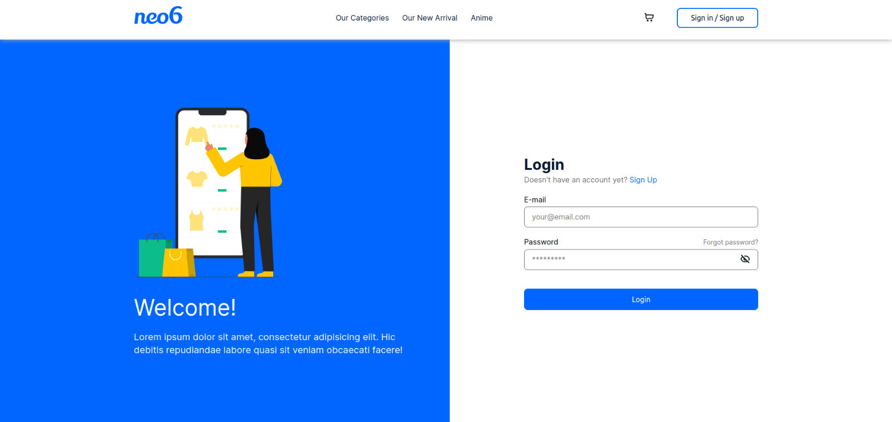
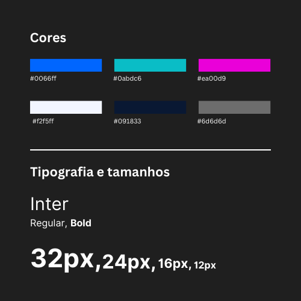
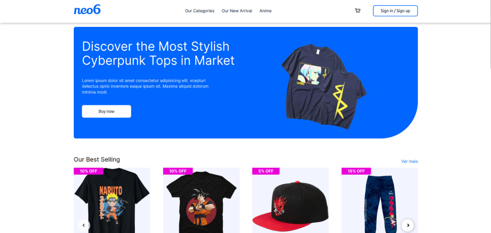
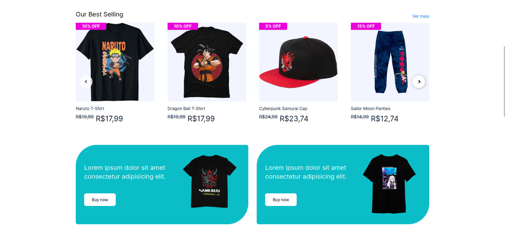
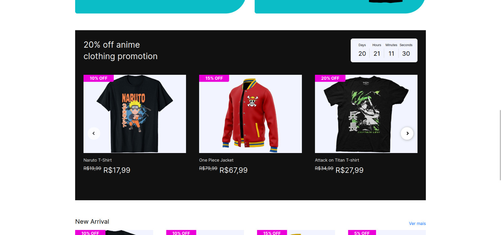
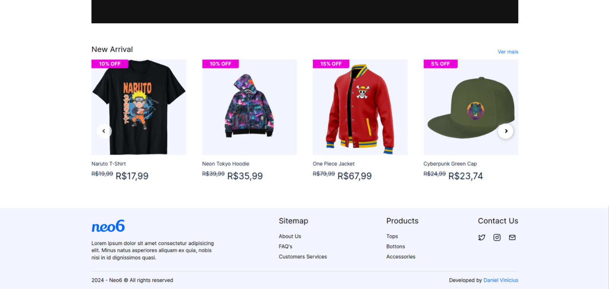
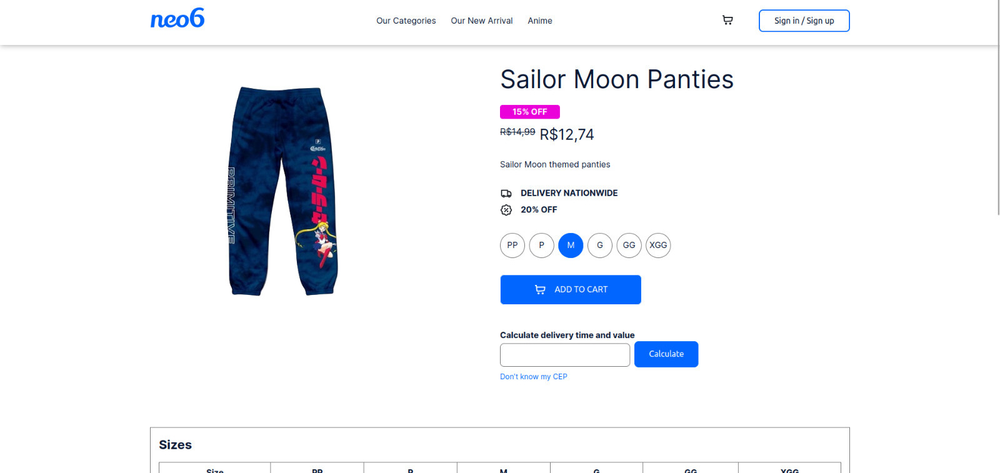
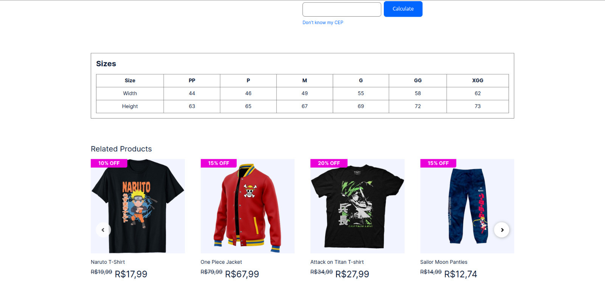
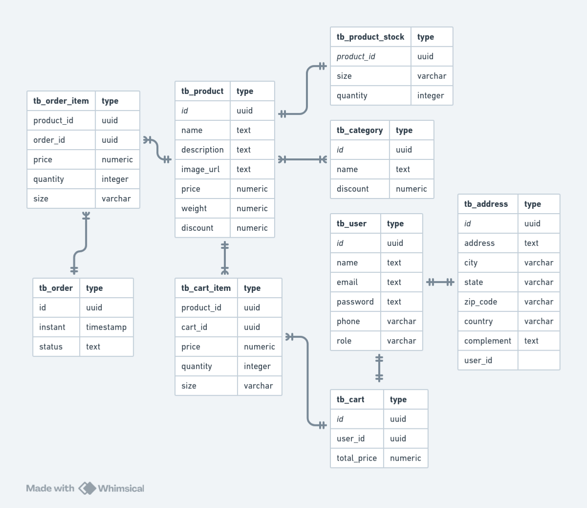

# Neo6 E-commerce

<div style="display: inline_block">
    
    
    
    
    
    
</div>
<br>

## Table of Contents

- [Introduction](#introduction)
- [UI elements](#ui-elements)
- [Presentation](#presentation)
- [Installation](#installation)
- [Usage](#usage)
- [Database and ERD](#database-and-erd)
- [API](#api)
- [Authentication](#authentication)
- [Microservices](#microservices)

## Introduction

Neo6 E-commerce is an application built on some of the hottest technologies such as [Spring Boot](https://spring.io/projects/spring-boot) and [Vue.js](https://vuejs.org/).
The aim of this project, in addition to practice these technologies, is to help shopkeepers build their online store.<br><br>
This project is still 🚧 <b>under development</b> 🚧

<div style="display: inline_block"><br>
    
</div>

## UI elements
<div style="display: inline_block"><br>
    
</div>

## Presentation
<div style="display: inline_block"><br>
    
    
    
    
    
    
</div>
<br>

## Installation

1. Clone the repository:

```bash
git clone https://github.com/danvinicius/neo6-ecommerce.git
```

2. Install dependencies with [Maven](https://maven.apache.org/)

3. Install [PostgresSQL](https://www.postgresql.org/)

4. Install [NodeJS](https://nodejs.org/pt) and [NPM](https://www.npmjs.com/)

## Usage

1. Go to /api folder and start the application with Maven
2. The API will be accessible at http://localhost:8080
3. Go to /client folder and install dependencies with [yarn](https://classic.yarnpkg.com/lang/en/docs/install/#debian-stable)
```bash
yarn install
```
4. Start application with [yarn](https://classic.yarnpkg.com/lang/en/docs/install/#debian-stable)
```bash
yarn dev
```
5. The Client will be accessible at http://localhost:5173

<br>

## Database and ERD
The project utilizes [PostgresSQL](https://www.postgresql.org/) as the database. The necessary database migrations are managed using [Flyway](https://flywaydb.org/).
<div style="display: inline_block">
    
</div>
<br>

## API
This API was built using **Java**, **Java Spring**, **PostgresSQL** as the database, **Feign Client**, **Flyway Migrations** and **Spring Security** with **JWT** for authentication control.
The API provides the following endpoints (API's base url is /api):

### Product
```markdown
GET /product - Retrieve a list of all products. (all users)

GET /product/{id} - Retrieve a product by its id. (all users)

POST /product - Register a new product. (ADMIN access required)

PUT /product/{id} - Update a product by its id. (ADMIN access required)

DELETE /product/{id} - Delete a product by its id. (ADMIN access required)
```
### Category
```markdown
GET /category - Retrieve a list of all categories. (all users)

GET /category/{id} - Retrieve a category by its id. (all users)

POST /category - Register a new category. (ADMIN access required)

PUT /category/{id} - Update a category by its id. (ADMIN access required)

DELETE /category/{id} - Delete a category by its id. (ADMIN access required)
```
### Shipping address
```markdown
GET /address - Retrieve a list of all addresses. (ADMIN access required)

GET /address/{id} - Retrieve an address by its id. (all authenticated users - address must belong to user)

POST /address - Register a new address. (all authenticated users)

PUT /address/{id} - Update an address by its id. (all authenticated users - address must belong to user)

DELETE /address/{id} - Delete an address by its id. (all authenticated users - address must belong to user)
```
### Order
```markdown
GET /order - Retrieve a list of all orders. (ADMIN access required)

GET /order/{id} - Retrieve an order by its id. (all authenticated users - order must belong to user)

POST /order - Register a new order. (all authenticated users)

PUT /order/{id} - Update an order by its id. (all authenticated users - order must belong to user)

PUT /order/{id}/cancel - Cancel an order by its id. (all authenticated users - order must belong to user)

DELETE /order/{id} - Delete an order by its id. (all authenticated users - order must belong to user)
```
### Cart
```markdown
GET /cart - Retrieve a list of all carts. (ADMIN access required)

GET /cart/{id} - Retrieve an cart by its id. (all authenticated users - cart must belong to user)

POST /cart - Register a new cart. (all authenticated users)

PUT /cart/{id}/item/add - Add a new item to cart. (all authenticated users - cart must belong to user)

PUT /cart/{id}/item/remove - Remove an item from cart. (all authenticated users - cart must belong to user)

DELETE /cart/{id} - Delete an cart by its id. (all authenticated users - cart must belong to user)
```
### User
```markdown
GET /user - Retrieve a list of all users. (ADMIN access required)

GET /user/{id} - Retrieve an user by its id. (ADMIN access required)

GET /user/me - Retrieve all info about request user. (all authenticated users)

POST /user - Register a new user. (all users)

PUT /user/{id} - Update a user by its id. (all authenticated users - user can only update himself)

DELETE /user/{id} - Delete a user by its id. (all authenticated users - user can only delete himself)

POST /auth - Login to the app. (all users)
```
<br>

## Authentication
The API uses Spring Security for authentication control. The following roles are available:

```
USER -> Standard user role for logged-in users.
ADMIN -> Admin role.
```
To access protected endpoints as an ADMIN user, provide the appropriate authentication credentials in the request header.
<br>

## Microservices
There's a connection to [Email Service](https://github.com/danvinicius/email-service-uber-challenge) using Feign Client to send emails at some events, e.g user registration.
<br>

# License
Neo6 E-Commerce is a truly open-source application that will always be free under the [MIT License](https://opensource.org/license/mit).

